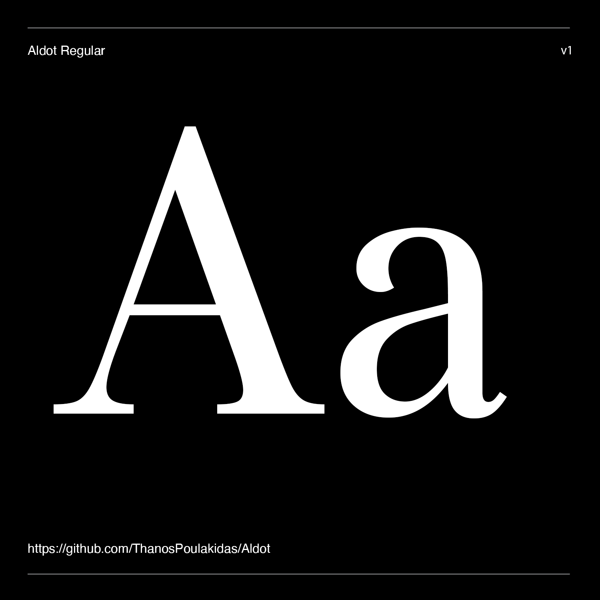

# Aldot

  

[![][Fontbakery]](https://ThanosPoulakidas.github.io/Aldot/fontbakery/fontbakery-report.html)

[![][Universal]](https://ThanosPoulakidas.github.io/Aldot/fontbakery/fontbakery-report.html)

[![][GF Profile]](https://ThanosPoulakidas.github.io/Aldot/fontbakery/fontbakery-report.html)

[![][Outline Correctness]](https://ThanosPoulakidas.github.io/Aldot/fontbakery/fontbakery-report.html)

[![][Shaping]](https://ThanosPoulakidas.github.io/Aldot/fontbakery/fontbakery-report.html)

  

[Fontbakery]: https://img.shields.io/endpoint?url=https%3A%2F%2Fraw.githubusercontent.com%2FThanosPoulakidas%2FAldot%2Fgh-pages%2Fbadges%2Foverall.json

[GF Profile]: https://img.shields.io/endpoint?url=https%3A%2F%2Fraw.githubusercontent.com%2FThanosPoulakidas%2FAldot%2Fgh-pages%2Fbadges%2FGoogleFonts.json

[Outline Correctness]: https://img.shields.io/endpoint?url=https%3A%2F%2Fraw.githubusercontent.com%2FThanosPoulakidas%2FAldot%2Fgh-pages%2Fbadges%2FOutlineCorrectnessChecks.json

[Shaping]: https://img.shields.io/endpoint?url=https%3A%2F%2Fraw.githubusercontent.com%2FThanosPoulakidas%2FAldot%2Fgh-pages%2Fbadges%2FShapingChecks.json

[Universal]: https://img.shields.io/endpoint?url=https%3A%2F%2Fraw.githubusercontent.com%2FThanosPoulakidas%2FAldot%2Fgh-pages%2Fbadges%2FUniversal.json

  

Aldot is a contemporary serif typeface that combines the elegance of old-style forms with the clarity and balance of the transitional tradition. Designed as a hybrid between these two historical models, it offers a refined reading experience while introducing subtle contemporary details that give the typeface a fresh and distinctive character. Particular attention has been given to the Greek alphabet, where carefully considered forms bring renewed vitality and a modern sensibility without sacrificing familiarity or readability.

Aldot is conceived as a versatile type family suitable for a wide range of applications. Its balanced proportions, moderate contrast, and carefully crafted details allow it to perform exceptionally well in long-form reading, making it ideal for books, editorial design, and extensive text settings. At the same time, its elegant presence and distinctive personality make it equally effective in titles, headings, and other display applications.

Every element of Aldot has been designed to achieve harmony between tradition and contemporary expression. Its letterforms preserve the warmth and rhythm associated with classical serif typefaces while incorporating refined adjustments that enhance legibility and visual consistency across different sizes and uses. Special emphasis on the Greek script ensures a cohesive relationship between the Latin and Greek alphabets, offering a unified typographic voice that feels both familiar and renewed.

By blending old-style warmth with transitional precision, Aldot presents a contemporary serif that balances heritage and innovation. Equally comfortable in extended texts, books, and titles, it offers a timeless typographic foundation with a distinctive freshness, particularly evident in its treatment of the Greek alphabet.

## Regular

Aldot has the following:

  
- Regular and Italic.
  

## Building

  

Fonts are built automatically by GitHub Actions - take a look in the "Actions" tab for the latest build.

  

If you want to build fonts manually on your own computer:

  

*  `make build` will produce font files.

*  `make test` will run [FontBakery](https://github.com/googlefonts/fontbakery)'s quality assurance tests.

*  `make proof` will generate HTML proof files.

  

The proof files and QA tests are also available automatically via GitHub Actions - look at https://ThanosPoulakidas.github.io/Aldot.

  

## Changelog

  

When you update your font (new version or new release), please report all notable changes here, with a date.

[Font Versioning](https://github.com/googlefonts/gf-docs/tree/main/Spec#font-versioning) is based on semver.

Changelog example:

  

**26 May 2021. Version 2.13**

- MAJOR Font turned to a variable font.

- SIGNIFICANT New Stylistic sets added.

  

## License

  

This Font Software is licensed under the SIL Open Font License, Version 1.1.

This license is available with a FAQ at

https://scripts.sil.org/OFL

  

## Repository Layout

  

This font repository structure is inspired by [Unified Font Repository v0.3](https://github.com/unified-font-repository/Unified-Font-Repository), modified for the Google Fonts workflow.
